# Computer Pointer Controller

In this project, the gaze estimation model is used to estimate the gaze of the user's eyes and change the position of the mouse pointer accordingly.

In addition, face-detection-adas-binary-0001 model is used for face detection, head-pose-estimation-adas-0001 model is used to obtain yaw angle, pitch angle and roll angle, landmarks-regression-retail-0009 is used to obtain two eyes landmarks, and gaze-estimation-adas-0002 is used for gaze direction estimation.

## Project Set Up and Installation
1. Download the Openvino toolkit 2020R2 from the official website.
2. 
python3 downloader.py --name face-detection-adas-binary-0001  -o ~/
python3 downloader.py --name head-pose-estimation-adas-0001 -o ~/
python3 downloader.py --name landmarks-regression-retail-0009  -o ~/
python3 downloader.py --name gaze-estimation-adas-0002  -o ~/
3. dependencies:
* pyautogui
pip3 install pyautogui
export DISPLAY=:0
touch ~/.Xauthority 
sudo apt-get install python3-tk python3-dev 
* cv2
sudo apt-get install python-opencv
4. directory structure
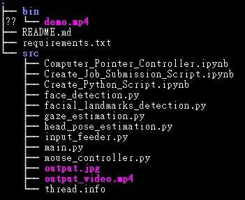

## Demo
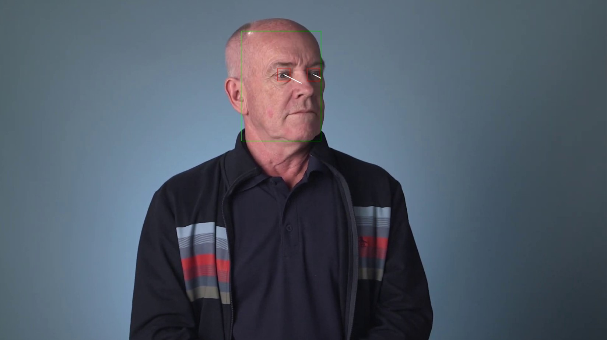

## Documentation
ex. python3 main.py --model_face_detection ~/intel/face-detection-adas-binary-0001/FP32-INT1/face-detection-adas-binary-0001 --model_head_pose_estimation ~/intel/head-pose-estimation-adas-0001/FP32/head-pose-estimation-adas-0001 --model_facial_landmarks_detection ~/intel/landmarks-regression-retail-0009/FP32/landmarks-regression-retail-0009 --model_gaze_estimation ~/intel/gaze-estimation-adas-0002/FP32/gaze-estimation-adas-0002 --input ../bin/demo.mp4 --device CPU 

--model_face_detection: name of face detection model
--model_head_pose_estimation: name of head pose estimation model
--model_facial_landmarks_detection: name of facial landmarks detection model
--model_gaze_estimation: name of model gaze estimation model
--input_path: video or camera path
--device: device name
--threshold: face detection probability threshold

## Benchmarks
1. FP32:
loading time:
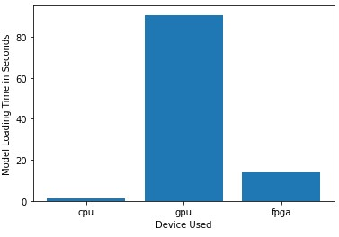
inference_time:
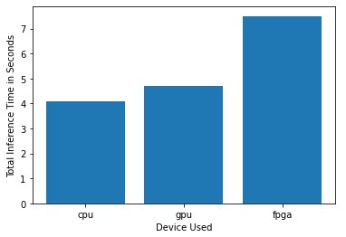
FPS:
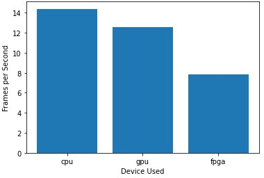
2. FP16
loading time:
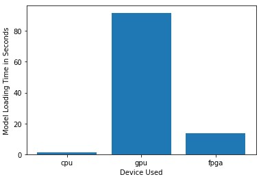
inference_time:
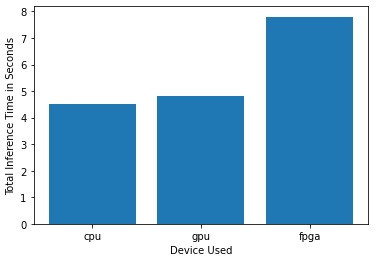
FPS:
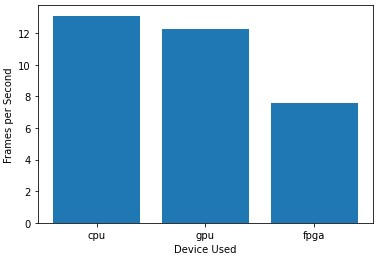
3. INT8
loading time:
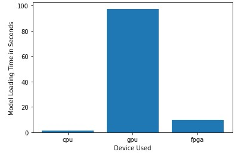
inference_time:
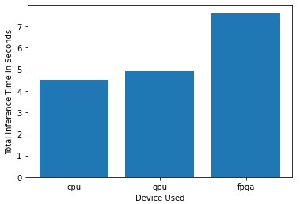
FPS:
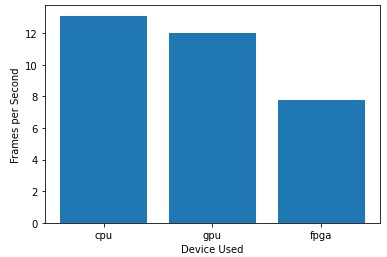

## Results
I expect that lower precision use less memory and lower computational complexity, so the inference speed is faster.
But the result is not particularly obvious, it looks similar, and sometimes the opposite result.
However the combined accuracy (FP16-INT8) obviously increases the computational complexity.

### Edge Cases
Increasing the probability threshold of face detection can help blur recognition.

### Comments
1. RuntimeError: Failed to compile layer "L0008_ActivationBin-back_bone_seq.conv2_2_sep_relubin_bin_conv_BIN01/Quantize_": unsupported layer type "FakeQuantize" for using intel-ncs2 MYRIAD
2. face-detection-adas-binary-0001 only has FP32-INT1
